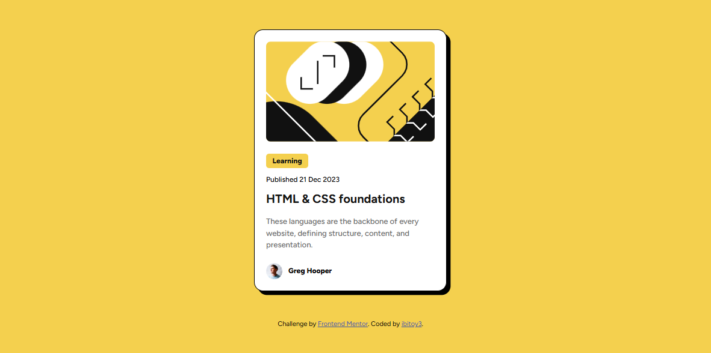

# Frontend Mentor - Blog preview card solution

This is a solution to the [Blog preview card challenge on Frontend Mentor](https://www.frontendmentor.io/challenges/blog-preview-card-ckPaj01IcS). Frontend Mentor challenges help you improve your coding skills by building realistic projects.

## Table of contents

- [Overview](#overview)
  - [The challenge](#the-challenge)
  - [Screenshot](#screenshot)
  - [Links](#links)
- [My process](#my-process)
  - [Built with](#built-with)
  - [What I learned](#what-i-learned)
  - [Continued development](#continued-development)
- [Author](#author)

## Overview

My solution to the Blog Preview Card Challenge from FrontendMentor.

### The challenge

Users should be able to:

- See hover and focus states for all interactive elements on the page

### Screenshot

### Links

- [Solution URL](https://github.com/ibitoy3/Blog-page-preview-card)
- [Live Site URL](https://ibitoy3.github.io/Blog-page-preview-card/)

## My process

The process involved a use of BEM and semantics, styling the document-block from start to end

### Built with

- Semantic HTML5 markup
- CSS custom properties
- Flexbox
- Mobile-first workflow

### What I learned

I improved further, my knowledge on the use of Flex, which now helps me to create a mental map in my head for the design process.

### Continued development

I will be focusing on Flexbox, trying to figure out it's limitations by extensive use.

## Author

- Website - [Ibitoye Ayomide]
- Frontend Mentor - [@ibitoy3](https://www.frontendmentor.io/profile/ibitoy3)
